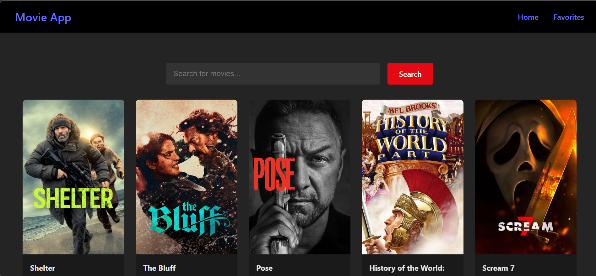
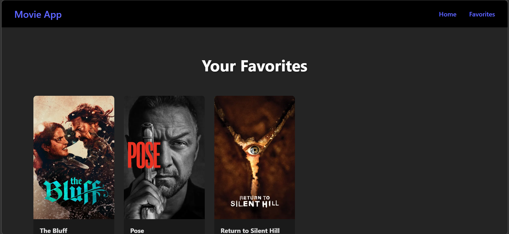

# 🎬 Movie App

A responsive movie browsing web application built with **React** that allows users to explore movies and save their favorite ones. The app uses **React Context API** for global state management and **Local Storage** to persist favorite movies. 

---

## 🚀 Features

- 🔍 Browse movies in a responsive grid layout
- ❤️ Add movies to Favorites
- ❌ Remove movies from Favorites
- 💾 Favorites are saved in **Local Storage**
- ⚡ Global state management using **React Context API**
- 📱 Fully responsive UI 
- 🎨 Clean card-based movie layout

---

## 🧠 What I Learned From This Project

- React component structure
- Using **Context API** for global state
- Managing state with **useState**
- Using **useEffect** for side effects
- Persisting data with **localStorage**
- Creating reusable components
- Building responsive layouts with **CSS Grid**
- Handling dynamic rendering with **map()**

---

## 🛠️ Tech Stack

- **React**
- **JavaScript (ES6+)**
- **CSS3**
- **Context API**
- **Local Storage**

---

## 📸 Screenshots
 
### Home Page

### Favorites Page
 
 